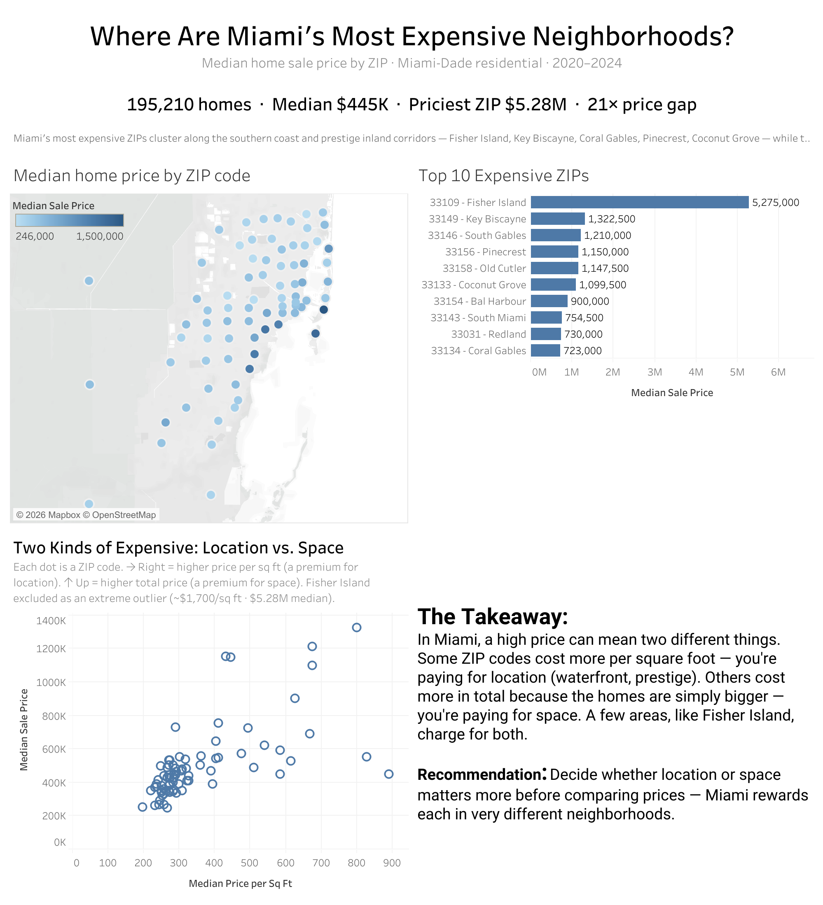

# Miami Real Estate: Where Are Miami's Most Expensive Neighborhoods?

I pulled 195,210 home sales from Miami-Dade's public records (2020–2026) and used
SQL and Tableau to figure out where prices are highest, and why some areas cost
more than others.

**[View the interactive dashboard on Tableau Public](https://public.tableau.com/app/profile/gianfranco.garcia/viz/MiamiRealEstate-MostExpensiveNeighborhoods/Dashboard1)**



## What I found
- The typical Miami home sold for about $445K (the median). The average is almost
  3x that, but a few huge sales drag it up, so the median is the number that
  actually describes a normal home.
- The most expensive ZIP, Fisher Island (33109), had a median of $5.28M. That's
  about 21 times the cheapest ZIP I looked at (33126, $246K).
- The priciest areas are mostly along the south coast, plus a few older inland
  neighborhoods like Coral Gables and Pinecrest. The cheaper ones are inland to
  the west and north (Hialeah, Little Havana, West Kendall).
- "Expensive" turned out to mean two different things. Some ZIPs are pricey because
  every square foot costs a lot (usually small condos in good spots). Others are
  pricey because the houses are just big. Only Fisher Island was both.

## The data
It comes from the [Miami-Dade County Open Data Hub](https://gis-mdc.opendata.arcgis.com/datasets/property-point-view/explore)
("Property Point View", around 943K properties). The column I planned to use,
assessed value, was completely empty in the public download, so I switched to the
actual sale price. That worked out better anyway, since it's real market data and
not a tax estimate.

## How I cleaned it
I went from ~943K raw records down to 195,210 real residential sales, and the
reasoning behind each cut matters as much as the cut itself:

- I kept only residential properties, since the question is about homes people live
  in, not land or offices. That meant dropping vacant land, commercial buildings,
  docks, parking garages, and other non-home types. It took a few passes (seven
  filter rules) because some non-homes are labeled in odd ways.
- I kept only sales from 2020 on, to reflect today's market instead of decade-old deals.
- I dropped any sale of $10,000 or less, and this one was a real judgment call. More
  than 300,000 sales were priced at $0 or $100, which are transfers between family or
  owners, not real prices. The data showed a clear gap right after that: almost
  nothing sold between $101 and $1,000 (about 600 sales total), so $1,000 is where
  symbolic prices end. I pushed the line up to $10,000 to also drop the scattered
  distressed and partial-interest sales in between, which don't reflect what a normal
  buyer pays. It moves the numbers, so I'm stating it instead of burying it.

I also switched from city to ZIP code. The city field was a mess: more than half the
sales fell into vague labels like "Miami" or "Unincorporated County", useless on a
map. ZIP codes are specific and Tableau maps them cleanly.

## The analysis
Two questions drove the dashboard.

First, where are prices highest? The most expensive ZIPs sit along the south coast
(Fisher Island, Key Biscayne) and in a few established inland neighborhoods (Coral
Gables, Pinecrest, Coconut Grove). I went in assuming it would all be waterfront, but
the prestige inland areas hold their own. The cheapest ZIPs are inland to the west
and north (Hialeah, Little Havana, West Kendall), and the priciest ZIP runs about 21
times the cheapest.

Second, is an area expensive because of location or because of size? To tell them
apart I took the median price per square foot for each ZIP. It splits into two kinds
of expensive: dense urban ZIPs like Downtown and Brickell charge a lot per square
foot but less in total (you're paying for location, in small well-placed condos),
while suburban ZIPs like Pinecrest have high totals but a moderate price per foot
(you're paying for space, in big houses). Only Fisher Island tops both.

One honesty note: Fisher Island sells for around $1,700 per square foot, way off from
everywhere else. I left it out of the scatter plot so it wouldn't flatten the rest,
and I said so on the chart instead of quietly hiding it.

## What's in this repo
- `queries.sql`: the full SQL, from loading and cleaning to the analysis.
- `data/clean_sales_tableau.csv`: the cleaned dataset I fed into Tableau (195,210 rows).
- The raw file (~400MB) isn't included since it's too big for GitHub; download it from the Open Data Hub link above.

The queries use window functions (ROW_NUMBER with PARTITION BY) for the median
price per ZIP, CASE statements for the residential filter and the size buckets,
and CREATE TABLE AS SELECT to build the clean table. SQLite has no median
function, so I rank the rows and average the one or two middle values, which
matches how Tableau computes the median.

## Reproduce it yourself
Everything in the dashboard comes straight out of `queries.sql`:

1. Download the raw "Property Point View" CSV from the Open Data Hub link above
   and save it as `miami_properties_raw.csv`.
2. Load it and run the queries:

   ```bash
   sqlite3 miami.db
   .mode csv
   .import miami_properties_raw.csv properties
   .read queries.sql
   ```

That rebuilds the clean table (195,210 rows) and prints every number behind the
dashboard, from the $445K median to the Top 10 ZIPs.

## Limitations
This shows patterns, not causes. Location and home size are tangled together (big
houses tend to sit in pricey ZIPs), so I don't claim one causes the other. I also
only ranked ZIPs with at least 100 sales, so a handful of tiny ZIPs are left out.

## Tools
SQL (SQLite) for loading, cleaning and analysis. Tableau Public for the map and charts.

## What I'd tell a buyer
In Miami the price tag matters less than what you're actually paying for: location or
space. They show up in completely different neighborhoods, so figure out which one
you care about before you start comparing prices.
